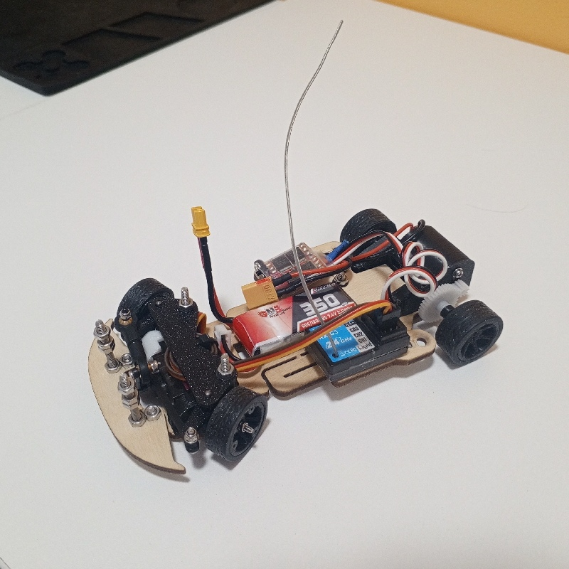

# SF24 — спецификация комплектующих
**Актуальна на сентябрь 2026**

Автор: Евгений Астапкович

## О ПРОЕКТЕ

Актуализированная спецификация для самостоятельной сборки SF24 со ссылками на комплектующие AliExpress и российских магазинов.

Здесь собраны:

- полный список деталей;
- количество деталей на одну машину;
- варианты замен;
- различия между версиями 3D-моделей;
- актуальные ссылки на комплектующие;
- ориентировочная стоимость сборки.

Спецификация подготовлена на основе открытых материалов проекта SF24 и личного опыта сборки.

⚠️***Это неофициальная спецификация.*** 
Автор этой спецификации не является разработчиком SF24. 
Его вклад — актуализация комплектующих, поиск доступных вариантов и подготовка данной спецификации.

## ССЫЛКИ ДЛЯ СКАЧИВАНИЯ

## [📦 Скачать спецификацию SF24 в формате .xlsx](docs/specification/SF24_Specification_BOM___.xlsx)
## [🛞 Скачать STL-модели колесных дисков для силиконовых шин](assets/models/models_of_disks_for_silicone_tires.zip)

## ИНСТРУКЦИЯ ПО СБОРКЕ
## [Скачать инструкцию по сборке (PDF-файл)](docs/INSTRUCTION_SF24_Final_V3.pdf)

## ВИДЕОИНСТРУКЦИЯ
https://rutube.ru/video/feb05db9436182b2d9cb688076ad8728/

## УТОЧНЕНИЕ ПРО АККУМУЛЯТОР
В исходном проекте SF24 предполагается использование аккумулятора 1s формата 18500. 
В своей сборке я использовал аккумуляттор 2s. Именно про такой написал в данной спецификации.

Если вы хотите аккумулятор, как в оригинальном проекте, то нужно искать:
- формфактор 18500 **(⚠️ ВНИМАНИЕ! НЕ 18650 - он не поместится на деку!)**
- есть никелевые выводы. Чтобы к ним припаять разъем (⚠️ паять напрямую к аккумулятору не рекомендуется - это может быть опасно, или выведет аккумулятор из строя).

[Ссылка на официальный магазин бренда LiitoKala на Алиэкспресс](https://aliexpress.ru/store/217753)

## Disclaimer
Это независимое руководство, созданное силами сообщества. 
SF24, его конструкция и соответствующие модели принадлежат их
соответствующим авторам. 
Ссылки, цены и наличие товара могут со временем меняться.

## GitHub проекта:
https://github.com/e-astapkovich/sf24-build-guide

## Контакты автора спецификации
VK: https://vk.ru/e.astapkovich 
Telegram: https://t.me/e_astapkovich

## Другие RC-проекты автора
⏳ Coming soon...

## Ссылка на исходный проект
Insane RC / SF24 
https://insane-rc.ru/product-category/insane/sf24/*
